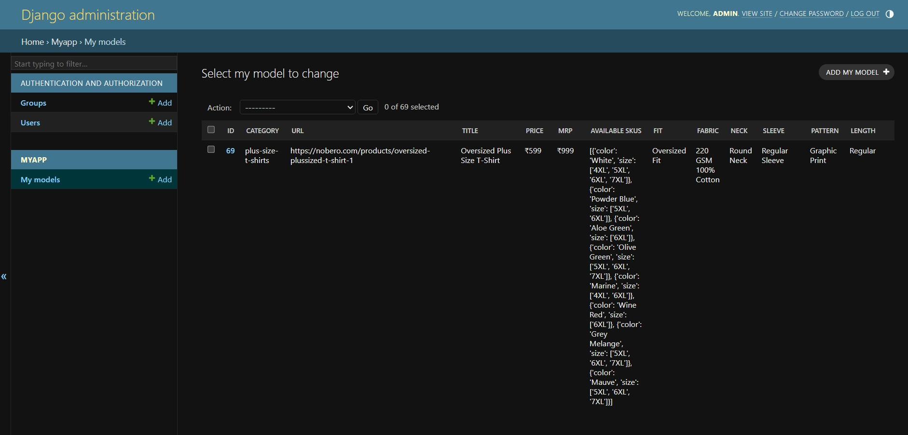
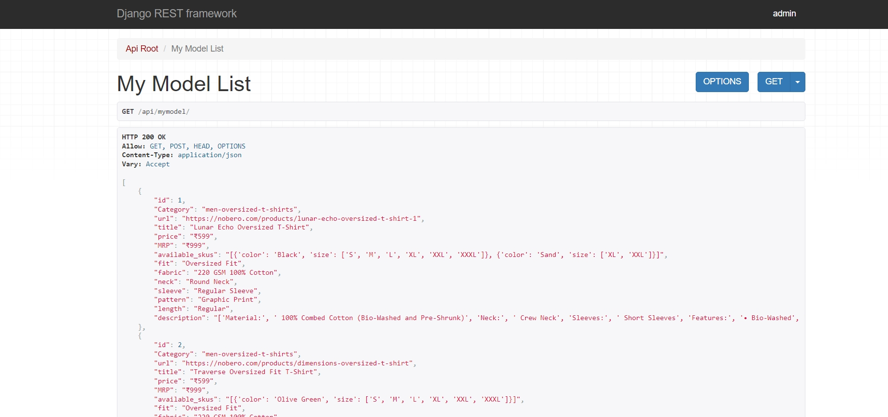

# Nobero E-commerce Scraping and API Project

## Overview

This project is an assignment for the internship selection process at Nobero E-commerce Pvt Ltd. The goal of this project is to scrape all men's wear products from the Nobero website using Scrapy, store the data in a database, and expose it via a REST API using Django REST Framework.

</img>
</img>
</img>

## Project Structure

- **Scrapy Spider**: Used to scrape men's wear products from the Nobero website.
- **Django Project**: Used to create a REST API and manage the database.

## Technologies Used

- **Scrapy**: For web scraping.
- **Django**: For creating the web application and REST API.
- **Django REST Framework**: For building the REST API.
- **SQLite**: As the database for storing scraped data.

## Setup Instructions

### Prerequisites

- Python 3.x
- pip (Python package installer)

### Installation

1. **Clone the Repository**:
   ```sh
   git clone https://github.com/AaronRM2003/Django-rest-api.git
   cd Django-rest-api
2. **Running the Scrapy Spider**

Navigate to the Scrapy Directory:

      ```sh
      cd scrapy_project

3. **Run the Spider:**
scrapy crawl cloth_products -o products.json

4. **Loading Data into Django**

Navigate to the Django Project Directory:

      ```sh
      cd ../django_project

**Apply Migrations:**

      ```sh
      python manage.py makemigrations
      python manage.py migrate

**Load Data from JSON:**
      
      ```sh
      python manage.py load_data

**Running the Django Server**

Start the Server:

      ```sh
      python manage.py runserver

Access the API: Open your browser and navigate to http://localhost:8000/api/mymodel/ to see the list of products.

**Project Details**

**Scrapy Spider**: The spider scrapes product details such as color, size, and availability from the Nobero website.

**Django Models**: The scraped data is stored in a Product model in the SQLite database.

**Django REST Framework**: The API exposes endpoints to access the product data.


## Conclusion

This project demonstrates the use of Scrapy for web scraping, Django for web development, and Django REST Framework for building RESTful APIs. It successfully scrapes men’s wear products from the Nobero website, stores them in a database, and exposes them via a REST API.
