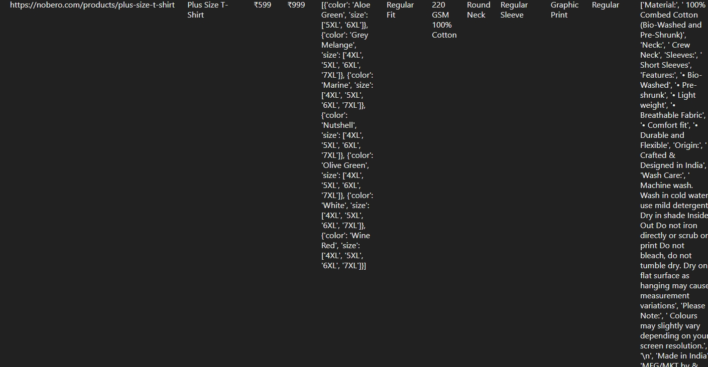

# Nobero E-commerce Scraping and API Project

## Overview

This project is an assignment for the internship selection process at Nobero E-commerce Pvt Ltd. The goal of this project is to scrape all men's wear products from the Nobero website using Scrapy, store the data in a database, and expose it via a REST API using Django REST Framework.

</img>
</img>
</img>

## Project Structure

- **Scrapy Spider**: Used to scrape men's wear products from the Nobero website.
- **Django Project**: Used to create a REST API and manage the database.

## Technologies Used

- **Scrapy**: For web scraping.
- **Django**: For creating the web application and REST API.
- **Django REST Framework**: For building the REST API.
- **SQLite**: As the database for storing scraped data.

## Setup Instructions

### Prerequisites

- Python 3.x
- pip (Python package installer)

### Installation

1. **Clone the Repository**:
   ```sh
   git clone <repository-url>
   cd <repository-directory>
